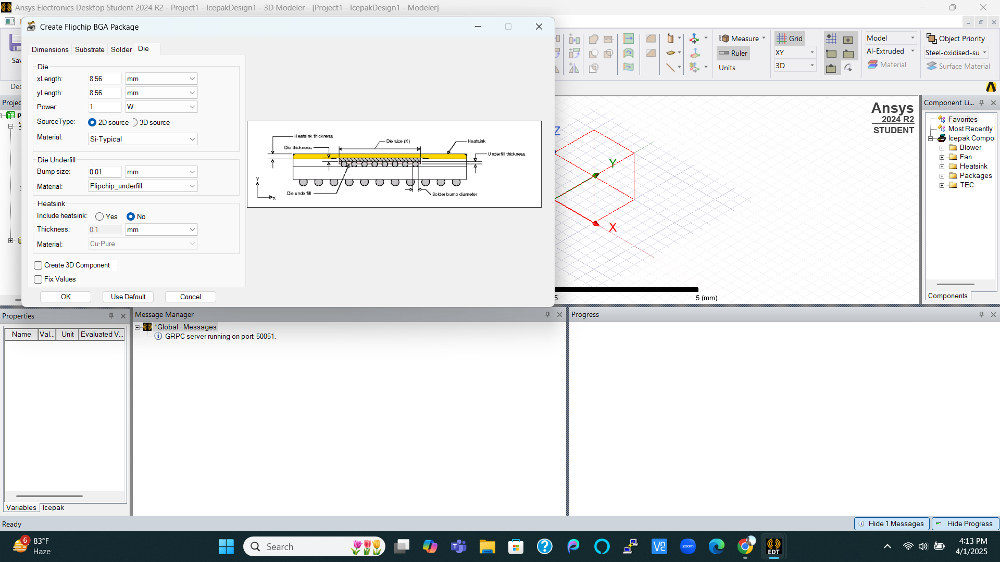

# SEMICONDUCTOR PACKAGING

[Module 1-Packaging evolution: From Basics to 3D Integration](#Module-1)

[Module 2-From wafer to package: Assembly and Manufacturing Essentials](#Module-2)

[Module 3-Labs: Thermal simulation of semiconductor Packages with ANSYS](#Module-3)

[Module 4-Ensuring Packaging Reliability: Testing and Performance Validation](#Module-4)

## MODULE 1

1.Why semiconductor packaging required?

* Semiconductor packaging is essential to protect the die from corrosion, moisture, and physical damage, and to enable connections to other components. It tranforms a fragile bare die into a functional part of real-world electronic systems like the iphone.

2.Packaging and testing industry

* The semiconductor packaging and testing industry involves fabless companies for design, foundries for wafer manufacturing, and OSATs for packaging and testing. After wafer processing, the chips undergo wafer testing, packaging, and final package testing. This process ensures chips are functional and ready for system integration.

3.Product requirements

* Choosing the right package depends on factors like application type, pin count, thermal dissipation, cost, form factor, and reliability. The package connects the chip to the board and plays a key role in the overall performance and durability of the product.

4.Typical package structure

* A typical package structure includes the die, carrier, mold compound, and the system board (PCB), all connected through interconnects. Carriers can be made from materials like leadframe, laminate, plastic, ceramic, or silicon. Interconnection methods include wirebond and bump/solder. Packages come in various types, such as DIP, QFN, CSP, PoP, and advanced ones like Intel’s MCM and Nvidia’s CoWoS. These structures ensure electrical connectivity, protection, and mechanical support for the chip.

5.Anatomy of packages

* Package anatomy includes different substrate types like leadframe, laminate, and advanced package substrates. Leadframe-based packages (e.g., DIP, QFN) use gold wirebonds and are simpler. Laminate-based packages like PBGA and FC-CSP offer higher pin density and performance. Advanced packages (e.g., 2.5D CoWoS) integrate multiple dies using interposers for high bandwidth and compact size. These packaging types support various levels of integration and functionality.

6.comparison and summary

* Semiconductor packaging ranges from simple single-chip packages like PBGA and FC-CSP to advanced multichip configurations such as 2.5D and 3D with interposers. These packages sit on a carrier substrate and are finally mounted onto a PCB. Each package type varies in terms of integration, performance, and application suitability. For example, DIP is low-cost and durable but has low pin count, while CoWoS offers high I/O and is used in AI GPUs. Higher-end packages support better performance, power efficiency, and miniaturization but may come with reliability and cost trade-offs. Choosing the right package depends on the target application, system complexity, and cost-performance balance.

## MODULE 2

1.Setting the stage - Supply chain and facilities

* This image provides an overview of the semiconductor supply chain. It starts with IC design at the design house using EDA tools and PDKs, followed by wafer fabrication using silicon wafers and various materials. The next step is package assembly and test, where individual ICs are packaged and tested. These packages are then integrated onto PCBs during the board assembly and test phase. Finally, all components come together in the product assembly and test stage, resulting in the final electronic product.

* A Package Manufacturing Unit carries out the ATMP process: Assembly, Testing, Marking, and Packaging. It can be operated in-house or by OSAT companies like ASE, Amkor, or TATA. The facility includes cleanrooms for processing, testing zones, material storage, and utility areas. For example, Micron’s Sanand facility spans 1.4 million sq. ft. with 500,000 sq. ft. of cleanroom space.

2.Wafer pre-preparation - Grinding and Dicing

* Activities inside the clean room area
   * Activities inside the cleanroom area (ISO class 7) begin with wafer preparation.
Incoming wafers are placed in carriers and undergo wafer inspection to check for defects.
Next, wafer front tape lamination is applied to protect the wafer surface.
Wafer backside grinding is performed to reduce thickness and improve die strength.
The wafer is then mounted on a tape frame for stability during dicing.
Two-step wafer dicing is done using laser grooving followed by blade dicing.
These steps ensure clean and precise die separation.
All processes are conducted in a clean environment to prevent contamination and ensure quality.

3. Wire Bond Packaging - Die Attach to Molding

* Wire bond packaging involves several key steps inside the cleanroom area:

  * Die attach begins by dispensing epoxy, picking up the chip, and placing it on the Die Attach Film (DAF).

  * The chip is then cured under controlled heat to secure it to the substrate.

  * Wire bonding follows, where thin gold or aluminum wires are used to connect the die to the package substrate.

  * The wire bonding process includes forming a ball bond, loop formation, and a crescent bond using ultrasonic energy and heat.

  * Once bonded, the die and wires are encapsulated using molding, where resin flows over the package for protection.

  * After molding, laser marking is done to label the package with ID or batch numbers.

  * The final step is singulation, where a dicing blade cuts the molded wafer into individual packages.

  * Throughout the process, cleanroom conditions prevent contamination.

  * Precision and alignment are critical to ensure proper electrical connectivity.

  * This method is widely used for its cost-effectiveness and reliability in IC packaging.

4. Flip Chip Assembly - Bump Formation And Underfill

* Flip Chip packaging process

  * Bump Formation: Solder bumps are formed on the silicon die.

  * Chip Flipping: The chip is flipped so the bumps face downward.

  * Flux Dispensing: Flux is applied on the bond pads of the package substrate.

  * Chip Placement: The bumped chip is placed onto the substrate.

  * Solder Reflow: The assembly is heated to reflow the solder, creating electrical and mechanical connections.

  * Flux Cleansing: Residual flux is cleaned using solvent spray.

  * Underfill Dispensing: Underfill material is added between the chip and substrate to enhance mechanical strength.

  * Underfill Curing: The underfill is cured with heat to solidify it.

  * Molding: The package is encapsulated with a protective mold compound.

  * Marking: Laser marking is done for identification and traceability.

  

5. Wafer level packaging
 
* Wafer Level Packaging (WLP) process involves the following steps:

   * Reconstitution Process: Known good dies are picked and placed on a temporary carrier.

   * Molding is done to form a solid base, creating a reconstituted wafer after releasing the carrier.

   * RDL (Redistribution Layer) Preparation: Multiple layers of dielectric and metal are coated and patterned to reroute I/O connections.

   * Solder Balls are attached on top of the RDL for external connectivity.

   * The wafer undergoes laser marking for identification and singulation to separate individual packages.

   * The final product is a Fan-Out Wafer Level Package, which offers a compact size and high performance.

   * WLP enables package miniaturization and is ideal for mobile and high-density applications.

 

 ## MODULE 3

 * Thermal simulation of Flip-Chip BGA Package.
   
 * Below steps explain how to set up the ANSYS tool to perform thermal simulation of Flip-Chip BGA package

 
 
 
 
 
 
 
 
 
 
 
 
 
 
 
 
 
 
 
 
 
 
 
 
 
 
 
 

 ## MODULE 4
 

